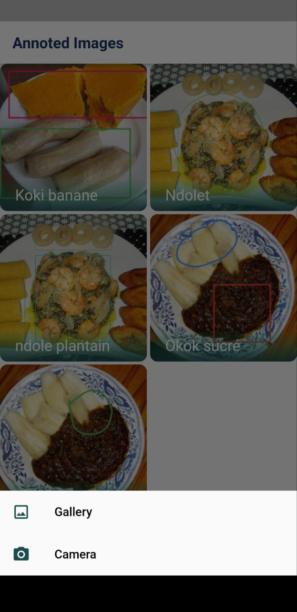
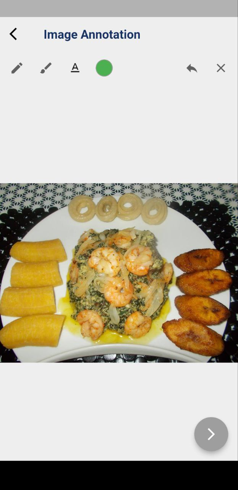
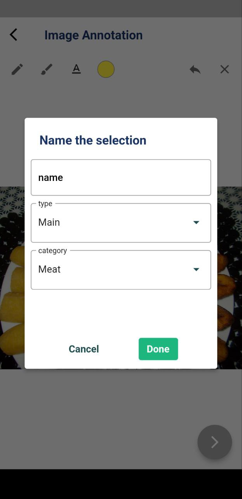
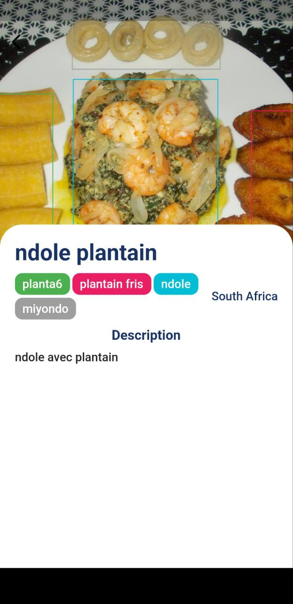

# Food Annotation Image App (Flutter)

## Description

This app allows users to take a picture of their food and annotate it with information such as the dish name, ingredients, and any other relevant notes. The annotated images can then be saved and organized for future reference.

## Features

- Take a photo of your food
- Add annotations such as dish name, ingredients, and notes
- Save and organize your annotated images
- Save position of annotation in json files
- View a history of all your annotated images

## Getting Started

1. Install the latest version of Flutter (https://flutter.dev/docs/get-started/install)
2. Clone the repository: `git clone https://github.com/main-c/Food-annotation-app-with-flutter.git`
3. Navigate to the project directory: `cd food-annotation-image-app`
4. Run the app on an emulator or device: `flutter run`

## Requirements

- A device or emulator running Android 
- The latest version of Flutter

## Built With

- [Flutter](https://flutter.dev/) - The framework used for building the app
- [Dart](https://dart.dev/) - The programming language used for the app

## License

This project is licensed under the MIT License - see the [LICENSE.md](https://chat.openai.com/LICENSE.md) file for details.

## Acknowledgements

- [Flutter](https://flutter.dev/) documentation for providing guidance on building the app
- [Dart](https://dart.dev/) documentation for providing guidance on programming the app

## Screens

|  |  |
| ------------------------ | ------------------------ |
|  |  |

Note

This is a school project and you should consider the data and information inside this app as for educational purpose only.
